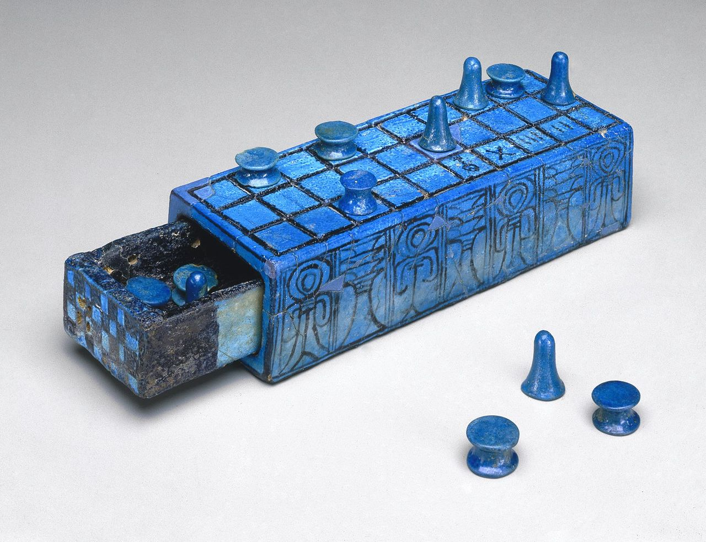
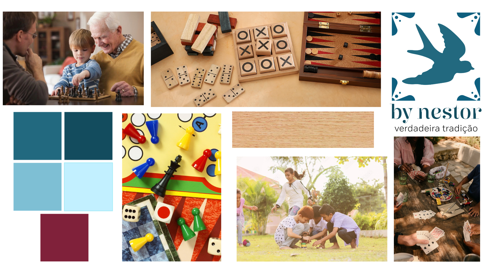
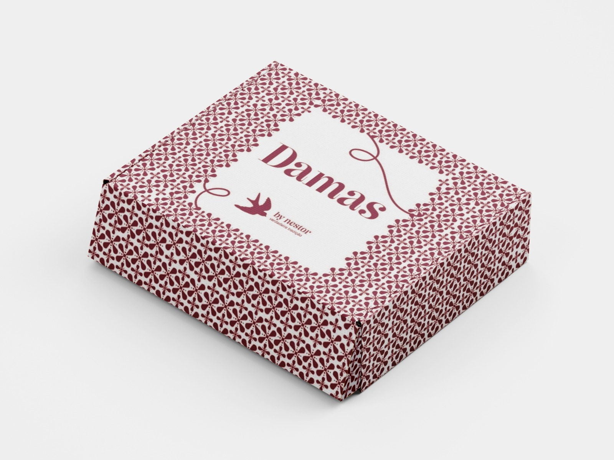
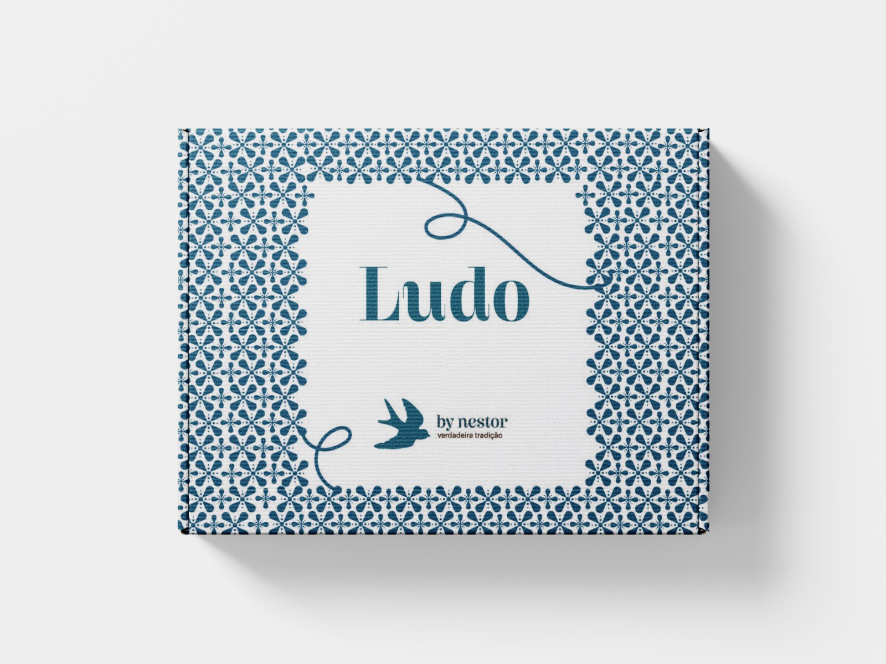
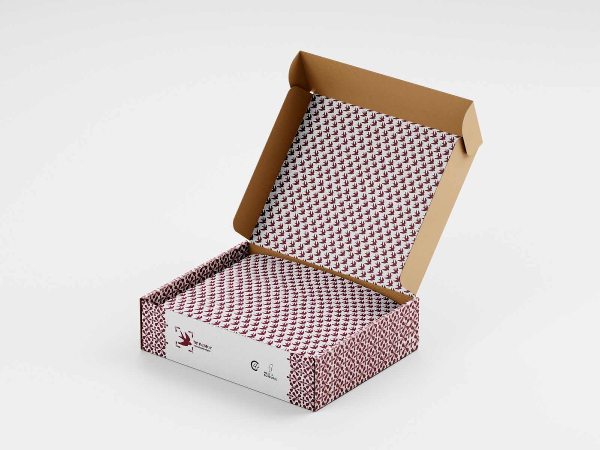

# Contexto de Design

## 1. Resumo / Abstract

### Resumo (PT)

Para desenvolvermos marca By Nestor, e de forma a respeitar os brinquedos de madeira modulares, pensámos nos jogos de tabuleiro porque inicialmente, muitos deles, eram feitos com madeira. Hoje em dia há milhares de versões para cada jogo, incluindo versões online.

Os jogos de tabuleiro são extremamente importantes a nível cognitivo e social (nomeadamente nas crianças):

- onde está implícito o perder e o ganhar, permitem que a criança aprenda a lidar com o sentimento de frustração, que é essencial para o seu equilíbrio emocional e para o desenvolvimento da personalidade;

- apesar de haver alguma competitividade, há também o espírito de equipa. Esta socialização será capaz de gerar comportamentos e noções de cooperação, autocontrolo e honestidade. Ao transferir essas competências para o ambiente escolar, vai gerar facilidade na compreensão de conteúdos e no processo comunicativo das crianças.

- de acordo com a neurociência, as atividades de lazer como os jogos de tabuleiro estimulam as conexões cerebrais e podem retardar o surgimento de doenças degenerativas como o Alzheimer.

- os jogos de tabuleiros podem-se tornar fundamentais no desenvolvimento e na formação das crianças pelas suas características lúdicas e pela sua importância pedagógica.

Com o excesso das tecnologias hoje em dia, transformar estes mesmos jogos em brinquedos de madeira e deixar de lado as suas versões online, acaba por ser um avanço muito positivo. Ao tornar esta jogabilidade intergeracional, permite às crianças e/ou adolescentes de estabelecerem relações com os avós, por exemplo, e além de proporcionar um momento familiar, os avós também conseguem estimular o seu cerébro. Há jogos de tabuleiros para todas as idades, sendo que não há limite. Uma boa aplicação de uso para estes jogos, seria também por exemplo em lares e residências séniores: onde as pessoas mais velhas aproveitam um tempo de lazer de maneira saudável.

### Abstract (EN)

To develop the By Nestor brand, and in order to respect modular wooden toys, we thought about board games because initially, many of them were made of wood. Nowadays there are thousands of versions for each game, including online versions.

Board games are extremely important at a cognitive and social level (especially for children):

- when losing and winning are implicit, it allows the child to learn to deal with the feeling of frustration, which is essential for their emotional balance and personality development;

- despite some competitiveness, there is also a team spirit effort. This socialization will be able to generate behaviors and notions of cooperation, self-control and honesty. By transferring these skills to the school environment, it will generate ease in understanding content and in the communicative process of children.

- according to neuroscience, leisure activities such as board games stimulate brain connections and can delay the onset of degenerative diseases such as Alzheimer's.

- Board games can become fundamental in the development and education of children due to their playful characteristics and pedagogical importance.

With the excess of technology nowadays, transforming these same games into wooden toys and leaving aside their online versions ends up being a very positive step forward. By making this gameplay intergenerational, it allows children and/or teenagers to establish relationships with grandparents, for example, and in addition to providing a family moment, grandparents can also stimulate their brains. There are board games for all ages, so there is no limit. A good application for these games would also be, for example, in nursing homes and senior residences: where older people enjoy leisure time in a healthy way.

## 2. Referências Coletivas

### 2.1. Recolha de Objetos a Redesenhar/Remisturar

Catálogo de objetos de partida que o grupo identificou para o redesenho. Para cada objeto: imagem, origem, motivo da escolha.

- **Jogo Senet** — O **Senet** é um dos jogos de tabuleiro mais antigos do mundo, com origens no Antigo Egito que remontam a mais de 5000 anos. O seu nome significa "passagem" e simboliza a viagem para o mundo dos mortos. Assim, encontram-se representações de pessoas a jogar ao Senet contra um adversário ausente nos monumentos fúnebres. A ausência de adversário humano indicia a presença de Osíris, Deus do Além. O jogo é considerado o antepassado egípcio do Gamão

### 2.2. Moodboard

Painel de referências visuais e conceptuais que orientam a estratégia do grupo.

### 3. Embalagem

